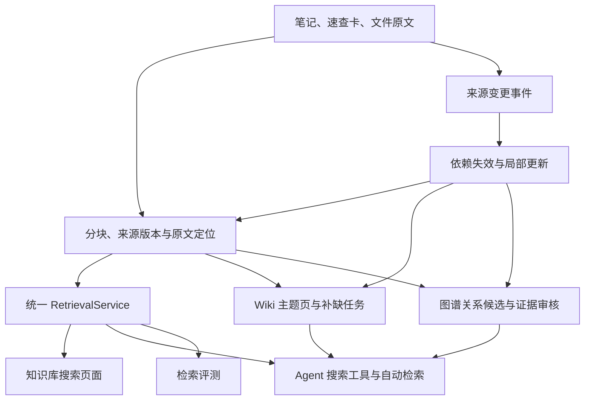

# Learn Hub 知识库完善方案

日期：2026-10-02。依据本次查看的工作区源码、表结构及本地 API；以下均为拟实施方案，本次没有修改业务功能。工作区已有后续改进，历史评估中的问题不能全部当成现状。

目标是让用户完成“找回资料 → 核对出处 → 理解概念 → 补齐知识 → 复习应用”的学习过程。继续使用现有 Spring Boot、Vue、MySQL、bge-m3 和 Milvus 适配器，以五个可独立验收的版本推进。

## 1. 当前基础与剩余问题

本次只读盘点：1,518 个索引块；Wiki 可见主题 52 个，已生成 42 页，其中实体页 36 个，索引已收录全部 36 个，主题列表中 4 页有质量告警；概念图 103 个节点、142 条边，其中推导边 41 条。这些是采样时的数量，验收应使用冻结的数据快照。

已有改进继续保留：速查卡引用兼容、全实体索引、MQTT 等明确主题优先匹配、缺口提示区分页内缺失与全库缺失、图谱节点过滤、无证据抽取边不参与自动注入。近期清理备份也应保留用于核对。

还需要解决的核心问题：

| 问题 | 本次实际证据 | 对应版本 |
| --- | --- | --- |
| 页面搜索与 Agent 检索不一致 | 页面“融合检索”调用 `/api/kb/search`，控制器直接调用 `VectorIndexService.search()`，实际为纯向量；聊天才使用 RRF 与重排 | V1 |
| 来源定位信息不充分 | 向量结果主要返回来源、正文、score、seq；Agent 自己的 Hit 会丢掉块定位信息，页面又截到 120 字 | V1、V2 |
| 检索模式存在共享可变状态 | `AgentService.retrieveRefs()` 临时修改单例字段 `suppressVector/suppressRerank` | V1 |
| 更新前先删除旧索引 | `indexSource()` 先删旧块，再生成新嵌入 | V2 |
| Wiki 更新依据尚未统一 | 已有列表层过期判断，但页详情路径仍写 `stale=false`；来源证据数仍按抽取批次累计 | V3 |
| 图谱语义问题仍存在 | 当前 Spring/JVM 探针仍列出 `JVM -属于→ Spring Boot 启动流程（推导）`；依赖词在本体中被映射为学习前置关系 | V4 |
| 质量结果未形成使用体验 | 后端有 grounding，AgentPanel 未消费；现有评测主要看来源命中 | V2、V5 |
| 后端状态与配置有差异 | 配置 Milvus，实际回退 MySQL；应明确展示实际工作状态 | V1 |

## 2. 共用的目标结构



原文是事实依据。Wiki 与图谱保存对原文的整理或结构化表达；回答需要事实证据时，沿依赖找到对应原文段落。页面、工具、自动检索和评测共用检索服务，但每次调用可以传入不同的预算、过滤条件和重排选项。

## 3. V1：统一检索，先让“找得到”稳定成立

**用户能得到的结果：**在知识库页面用一句话描述问题，可得到与 Agent 使用同一算法的相关资料；类名、命令检索保持精确；搜索模式和降级提示与实际行为一致。

后端拟新增 `RetrievalService`、`SearchRequest`、`SearchResponse`：从 `AgentService` 抽出词面召回、向量召回、融合、去重和重排，复用 `KnowledgeService`、`VectorIndexService` 和现有重排服务。`AgentService` 负责会话与工具编排，`RagEvalService.Retriever` 改由独立检索适配器实现。

检索模式统一为 `keyword / semantic / hybrid`。现有 `fusion/fused/vector/ref` 等名称在入口做兼容归一化，内部使用一个规范值。通过不可变的每次调用参数传递模式，移除依靠共享字段切换评测模式的实现。

拟新增只读搜索接口 `POST /api/knowledge/search`，保留旧 GET 接口兼容已有调用：

```json
{
  "query": "大量字符串拼接用哪个类性能更好",
  "mode": "hybrid",
  "topK": 10,
  "filters": { "sourceTypes": ["note", "quick_ref", "file"] },
  "rerank": true
}
```

统一返回的数据需要包含：`sourceType`、`sourceId`、`sourceHash`、`title`、`chunkId`、`seq`、`heading`、`snippet`、`anchor`、`rank`、召回路径及实际生效模式。诊断信息包含实际向量后端、降级原因、耗时、候选数；页面只展示有助于用户判断的信息，例如“向量检索暂不可用，本次使用关键词检索”。

融合依据名次而非直接相加不同量纲的 score。按块保留证据，再限制每个来源的展示占比；跨资料题要能保留多个必要来源，同一资料的两个不同答案段落也不能被来源去重丢掉。重排开关和预算显式记录，默认值由当前冻结语料上的基线测试确定。

页面增加来源与分类筛选；默认按相关性展示混合列表。输入为空时展示最近资料，并注明当前是最近列表。已有索引体检与后端配置放进可展开的状态区，主界面以搜索和结果为中心。

**验收：**

- “大量字符串拼接用哪个类性能更好”前五结果有目标速查卡；`StringBuilder`、`docker exec` 等精确词可找回正确内容。
- 相同请求参数在页面 API、Agent 搜索工具、评测中得到相同排序；不同调用预算造成的差异可解释。
- 聊天与 keyword/vector 评测并发时，检索模式互不影响。
- 嵌入或 Milvus 不可用时，仍有词面结果，并返回实际降级信息；真正无结果与服务故障可区分。

## 4. V2：补齐出处，使“找到了”变成“可以核对”

**用户能得到的结果：**点搜索结果或回答引用，直接看到相关小节；来源变化时能知道引用过期；回答里的“参考了哪些资料”与实际使用的证据一致。

给 `kb_chunk` 补充 `source_hash` 与 `anchor_json`。笔记锚点包含标题路径、稳定段落/块标识和必要的文本位置；速查卡锚点包含条目位置；PDF 锚点包含页码和对应文本块。已有 `PdfLayoutExtractor` 提供页级排版结构，但检索正文来自另一条抽取路径，需要建立两种文本表示之间的映射，不能直接认为字符偏移可互用。遇到无法可靠定位的 PDF，先打开文件文本预览并明确显示“位置尚未定位”，再补充页码映射。

拟新增 `GET /api/knowledge/chunks/{chunkId}` 返回命中段、相邻上下文、来源版本及打开位置。引用同时保存来源 ID、当时的 sourceHash 与证据摘录，不能只依赖会在重索引时变化的 chunkId。原文被修改后显示“来源已更新”，不能悄悄把旧引用跳到不相关的新段落。

Agent 搜索工具获得块级证据，按需读取相邻段落或完整小节。记录候选来源、预算内实际注入、工具读取、最终引用四种状态；界面将“检索到”与“答案引用”准确区分。补上 grounding 展示，但文案使用“证据核对提示/待核对”，不把模型核对通过说成绝对事实正确。核对输入要覆盖工具读取的证据，并分别处理库内资料与通用知识。

索引更新改为：先在事务外解析并生成新嵌入，成功后在 MySQL 事务内替换该来源块和索引状态；失败保留旧块，明确标记待更新。事务提交后同步外部向量后端；同步失败记录状态并使用 MySQL，不能把跨 MySQL/Milvus 写入当成一个原子事务。

**验收：**回答和搜索引用可定位到测试来源的正确小节/页；删除或编辑来源后有明确状态；重索引失败仍能查询旧版；显示的实际注入来源不包含因预算被丢弃的条目；完整代码/表格不会只因展示摘要被误认为没有内容。

## 5. V3：把 Wiki 做成可维护的主题学习页

**用户能得到的结果：**从一个主题看到定义、自己的资料、相关概念、待补任务和最近核对时间；修改一份笔记只影响真正依赖它的页面。

复用 `wiki_page`，新增 `knowledge_dependency` 存储：

```text
owner_type, owner_key, source_type, source_id, source_hash, anchor_json
```

`owner` 可为 Wiki 页、图谱关系或缺口任务。增加所有者与来源方向的索引，并建立唯一约束避免重复依赖。实际独立来源数从去重依赖集合计算，替代抽取批次计数；只从生成文本里解析引用可作为旧数据回填的线索，不能据此认定证据已经完整核对。

扩展 `KnowledgeChangedEvent`，携带 `sourceType/sourceId/changeType/contentHash` 及受影响分类、标签。变更后先按来源依赖标脏，再按分类/标签集合变化处理新增成员影响；生成一个主题时还要保存所覆盖的主题成员或目录版本，才能知道新加资料应当影响哪个页。

过期计算由共用的 FreshnessService 提供，列表、详情、注入探针采用一致逻辑；自检报告也保存输入清单/版本，展示扫描日期与覆盖范围。已标脏页面仍可读，自动更新采用防抖、去重及任务预算，优先更新常用主题。

长文编译按完整章节目录选材并分批整理：先形成章节摘要，再生成主题页；保留每个结论对应的原文块。优先复用已有章节索引，逐步消除“先截前 14,400 字再采样”的限制。覆盖信息分开显示“本次读取了哪些章节”与“尚未处理哪些章节”，不能把字符比例当知识完整度。

新增 `knowledge_gap`，用于把“待补充”转成任务：`topicKey`、`kind`、`description`、`status`、相关证据、创建/核对时间、处理后的笔记 ID。缺口类型至少区分页面未展开、素材采样未覆盖、检索核对后仍未找到材料。最后一种结论必须注明核对的资料范围与时间。

页面增加“查看相关原文”“补充这一点”“已有材料，重新整理”“完成任务”。同名工具页可归并成规范入口；IoC/DI、Maven/坐标等不同层级概念保留关联和小节。先做一次影响分析，展示拟更新页及任务规模，再通过现有生成入口执行局部更新。

**验收：**修改或删除某个来源，相关页和关系标脏，无关页不变；新增主题成员也能检测；列表与详情 stale 一致；来源数等于独立来源数；待补项能关联原文或补写笔记，并且可完成；旧页面的人工作业不会因自动生成被无提示覆盖。

## 6. V4：把图谱做成有证据的关系工具

**用户能得到的结果：**查看概念关系时能核对证据；得到可靠的对比和前置知识提示；清楚区分原文事实、模型候选、规则推导。

复用 `kg_node` 作为规范概念登记表，Wiki 页增加可选 `entity_id`，通过登记表维护别名与跳转。已发布概念 ID 保持稳定，重命名修改显示名、规范名及别名；旧 Wiki 链接保留映射。模型只提出归并候选，相邻概念和父子主题不直接合并。

给 `kg_relation` 增加 `review_status`（pending/accepted/rejected）、审核时间与说明；依赖表保存来源块及版本。节点名过滤继续保留，同时新增关系判据：

- `part_of` 表达组成部分，依赖运行环境不能自动归入此关系。
- 新增 `depends_on` 表达技术/运行依赖，并按关系类型定义可否传递。
- `prerequisite` 只表达学习前置；方向明确为“A 的学习需要先掌握 B”，不能从“软件依赖 B”直接推出。
- 推导只使用已确认且未过期的直接边，保存完整可展开推导依据；任一前提被删除、修改或拒绝时，派生边失效。

审核是关系语义与方向的核对，不能只检查是否存在 evidence 字符串。先整理常用的 Java、Spring、Agent、RAG 关系作为样例集，对现有前置/组成边逐条优先核对。旧边保持可浏览但标注待核对，不因为统一权重 0.9 就标为事实已确认。

前端以“相关资料”“两个概念对比”“前置知识”作为主要任务入口，提供局部图与证据面板；模型候选和推导关系有清楚标记。图谱按关系问题选择使用，普通语法/命令问题优先走原文检索。

**验收：**探针不再输出“JVM 属于 Spring Boot 启动流程”等无事实支持的结论；技术依赖与学习前置互不混用；每条用于回答的关系都有有效的原文支持或可追溯推导；修改一条前提，关联推导被撤销；别名可以找到同一概念，旧链接有效。

## 7. V5：用评测与学习任务检验价值

**用户能得到的结果：**系统能够说明一次回答参考了什么、哪里证据不足；首页能进入待补和待核对任务；开发者知道每次改动是否有实际收益。

保留现有 97 题作为历史回归基线。另加 30 条人工标注题：关系 10、跨资料综合 10、缺口/无答案 10。标注正确证据段、必要来源集合、关键事实、不可编造的结论。跨资料题同时提供 ANY（可接受来源）与 ALL（必须覆盖的来源）评分，不再只按任一命中计算。

检索评测由统一 RetrievalService 执行；答案评测新增独立运行记录，保存语料指纹、模型配置、模式、相关 prompt 版本、结果、引用及耗时。展示来源命中、证据段命中、事实正确、引用支持、无答案处理和成本。Grounding 或另一个模型的评分仅作辅助，关键差异人工核对。

先在 10 个有代表性的问题上比较“基础检索、加 Wiki、加图谱、两者都加”四组；可解释的收益出现后扩展到完整 30 题。同题多轮运行报告波动，并排除输出被截断或检索服务失效的污染。运行前给出预计调用数量与预算，不默认批量消耗模型额度。

首页复用既有 ActivityHeatmap 与 LearningActivityService，增加“待补知识”“待核对关系”“最近学习主题”入口。热力图继续表示学习行为，任务完成和有用资料点击单独记录，用于判断知识库是否帮助了学习。提供轻量“有用/没有解决”反馈，关联到检索/回答 trace。

**验收：**同一语料能复现同一配置的检索结果；历史与新语料结果不混用；来源命中与答案正确分开显示；首页任务来自真实缺口/核对状态，可回到原文完成；图谱或 Wiki 的默认注入策略依据明确的题型收益决定。

## 8. 最小数据库改造

| 对象 | 拟增加内容 | 目的 |
| --- | --- | --- |
| `kb_chunk` | 来源指纹、原文锚点 | 稳定引用、段落定位、识别过期 |
| `wiki_page` | 可选概念 ID、生成快照信息 | 与图谱共用身份，记录生成依据 |
| `kg_relation` | 审核状态与说明 | 区分候选关系与可使用事实 |
| `knowledge_dependency`（新） | 产物→原文及版本/位置 | 查影响、局部更新、统计独立来源 |
| `knowledge_gap`（新） | 缺口类型、状态、证据、完成去向 | 可执行的补缺任务 |
| 答案评测运行记录（新） | 语料版本、配置、答案、引用、评分 | 衡量回答层面的收益 |
| 构建任务记录（需要持久恢复时增加） | 输入版本、状态、失败信息、重试 | 重启可恢复、避免重复生成 |

迁移采用扩展兼容：先增加可空字段和新表，旧客户端保持可读；回填引用、锚点和概念映射，无法确认的内容标记待核对；再逐步切换新路径。沿用当前幂等迁移机制，改造前备份相应记录，按来源/主题试跑后扩大范围。

## 9. 开发交付顺序

| 批次 | 本批必须交付 | 依赖 |
| --- | --- | --- |
| V1 | 统一检索服务、真实融合主搜索、工具/评测接入、并发与降级验证 | 现有检索基础 |
| V2 | 来源定位、引用面板、实际证据记录、失败保留旧索引 | V1 的统一结果结构 |
| V3 | 依赖表、来源变更事件、统一过期状态、局部 Wiki 与缺口任务 | V2 的来源版本和锚点 |
| V4 | 概念身份互通、关系审核、方向判据、推导失效 | V2/V3 的来源依赖 |
| V5 | 答案对照评测、首页学习任务、反馈闭环 | 各版本的 trace 与任务状态 |

每批实现后运行现有相关 Java 单测和前端构建，补充能验证真实失败模式的测试：检索模式并发隔离、嵌入失败不丢索引、引用定位随原文更新失效、来源增删改正确标脏、错误前提不进入推导。数据库测试使用可回滚事务或独立测试库；涉及模型的运行单独记录成本与波动，避免和确定性测试混为一谈。

第一批只需把统一检索及结果结构做好即可验收。PDF 页码精确定位、跨页总结、图谱审核与首页任务按后续批次交付，防止一个版本同时承担全部改造。

## 10. 主要改动位置

- [Knowledge.vue](C:/Users/dyh/WorkBuddy/2026-09-07-15-46-17/learn-hub/frontend/src/views/Knowledge.vue)：统一搜索请求、结果排序、出处、Wiki 与图谱任务入口。
- [KnowledgeService.java](C:/Users/dyh/WorkBuddy/2026-09-07-15-46-17/learn-hub/backend/src/main/java/org/dyh/learnhub/service/KnowledgeService.java)、[VectorIndexService.java](C:/Users/dyh/WorkBuddy/2026-09-07-15-46-17/learn-hub/backend/src/main/java/org/dyh/learnhub/service/VectorIndexService.java)：复用召回能力、补充块定位、改进更新顺序。
- [AgentService.java](C:/Users/dyh/WorkBuddy/2026-09-07-15-46-17/learn-hub/backend/src/main/java/org/dyh/learnhub/ai/AgentService.java)、[RagEvalService.java](C:/Users/dyh/WorkBuddy/2026-09-07-15-46-17/learn-hub/backend/src/main/java/org/dyh/learnhub/service/RagEvalService.java)：接入统一检索、移除共享模式字段、证据与评测记录。
- [WikiService.java](C:/Users/dyh/WorkBuddy/2026-09-07-15-46-17/learn-hub/backend/src/main/java/org/dyh/learnhub/service/WikiService.java)、[EntityCompileService.java](C:/Users/dyh/WorkBuddy/2026-09-07-15-46-17/learn-hub/backend/src/main/java/org/dyh/learnhub/service/EntityCompileService.java)：依赖、来源计数、生成快照、局部编译与任务。
- [KgGraphService.java](C:/Users/dyh/WorkBuddy/2026-09-07-15-46-17/learn-hub/backend/src/main/java/org/dyh/learnhub/service/KgGraphService.java)、[KgOntology.java](C:/Users/dyh/WorkBuddy/2026-09-07-15-46-17/learn-hub/backend/src/main/java/org/dyh/learnhub/service/KgOntology.java)：概念身份、事实审核、依赖/前置区分、推导失效。
- [AgentPanel.vue](C:/Users/dyh/WorkBuddy/2026-09-07-15-46-17/learn-hub/frontend/src/components/AgentPanel.vue)、[Dashboard.vue](C:/Users/dyh/WorkBuddy/2026-09-07-15-46-17/learn-hub/frontend/src/views/Dashboard.vue)：引用核对、学习任务与反馈。

整体完成标准是用户能找到正确原文、核对回答、识别过期内容、完成补缺任务。页面数量、图谱节点数量和模型调用次数作为运行数据记录，不作为知识库质量的成功指标。
